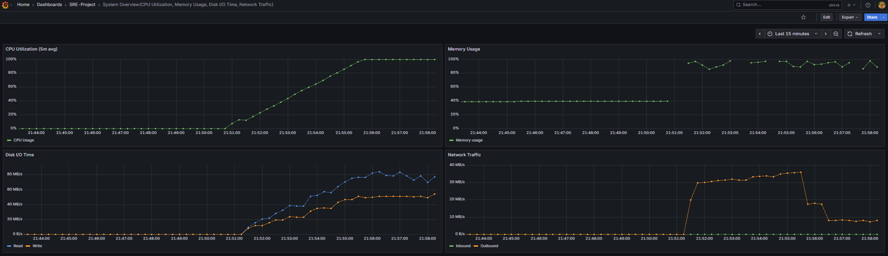
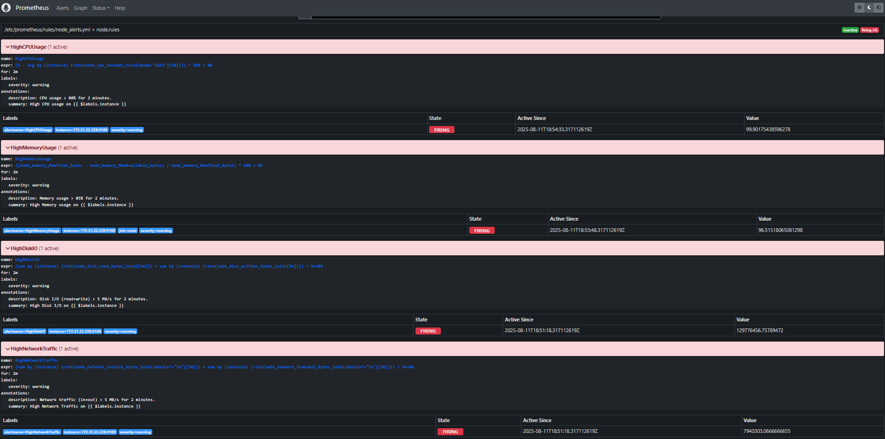
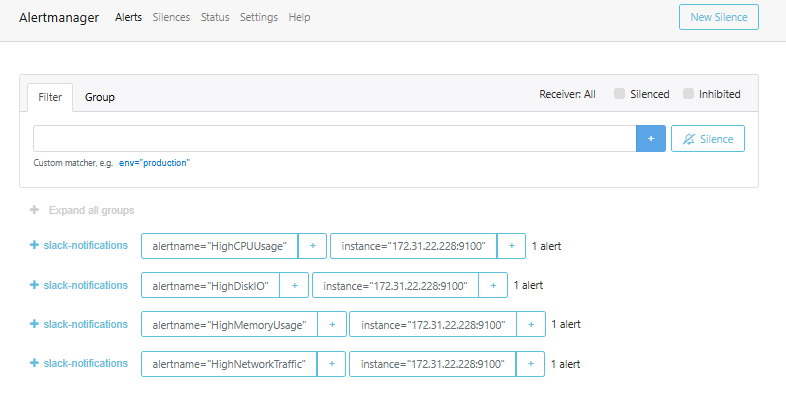
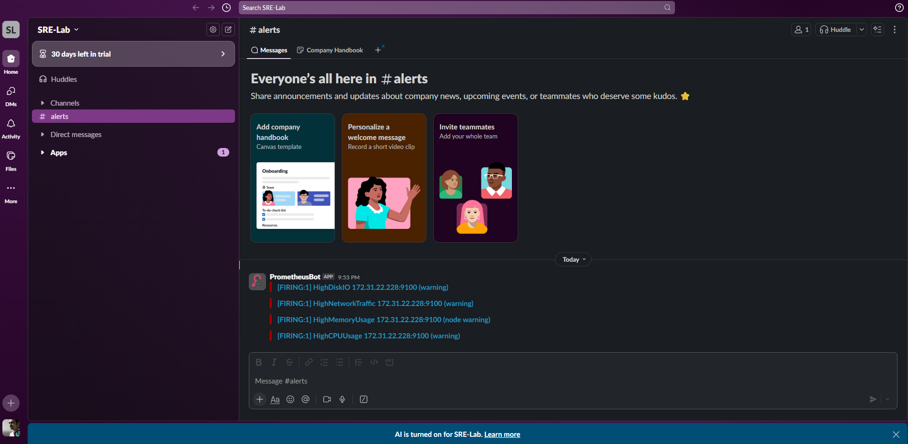

# Prometheus Monitoring Lab

This project demonstrates a monitoring setup with **Prometheus**, **Alertmanager**, **Grafana**, and **Node Exporter**.  
It includes alerting rules, integrations with Slack, and stress testing scripts to trigger alerts for demo purposes.

---

## Project Structure

```
prometheus-monitoring-lab/
│
├── configs/
│   ├── prometheus.yml       # Prometheus main config
│   ├── node_alerts.yml      # Alert rules for CPU, Memory, Disk, Network
│   ├── alertmanager.yml     # Alertmanager configuration with Slack webhook
│
├── scripts/
│   ├── fire_all_stable.sh   # Trigger all alerts (except Node Down)
│   ├── stop_stable.sh       # Stop all stress tests
│
├── images/
│   ├── Alertmanager_notification.png
│   ├── Slack_notification.png
│   ├── Grafana_graphs.png
│   ├── Prometheus_firing.png
│
└── README.md
```

---

## How to Run

1. **Start Prometheus, Alertmanager, and Node Exporter**
   ```bash
   prometheus --config.file=configs/prometheus.yml
   alertmanager --config.file=configs/alertmanager.yml
   node_exporter
   ```

2. **Start Grafana**
   - Import dashboards for Node Exporter CPU, Memory, Disk, and Network.
   - Connect Grafana to Prometheus.

3. **Trigger All Alerts for Testing**
   ```bash
   ./scripts/fire_all_stable.sh
   ```

4. **Stop All Tests**
   ```bash
   ./scripts/stop_stable.sh
   ```

---

## Sample Dashboards & Alerts

### Grafana Dashboard


### Prometheus Firing Alerts


### Alertmanager Notifications


### Slack Notifications


---

## Notes
- The scripts use `stress-ng`, `dd`, and `iperf3` to generate CPU, Memory, Disk, and Network load.
- Network traffic tests require **iperf3** to be installed on both the Prometheus server and the monitored node.
- Adjust alert thresholds in `configs/node_alerts.yml` to suit your environment.

## Prometheus Monitoring Lab – Overview

### 1. Objective
- Configure a monitoring environment using **Prometheus**, **Alertmanager**, **Grafana**, and **Node Exporter**.
- Create alerts for server resource usage and send notifications to **Slack**.
- Simulate real load scenarios to test alerts.

---

### 2. System Architecture
- **Prometheus** – Collects metrics from servers (via Node Exporter).
- **Alertmanager** – Manages alerts and sends Slack notifications.
- **Grafana** – Displays metrics and alerts in custom dashboards.
- **Node Exporter** – Exposes hardware and OS metrics.
- Slack integration via **Incoming Webhook**.

---

### 3. Main Configurations
- **`prometheus.yml`** – Configures scrape targets and alert rules.
- **`node_alerts.yml`** – Defines rules for:
  - High CPU Usage (>80%)
  - High Memory Usage (>85%)
  - High Disk I/O (>5 MB/s)
  - High Network Traffic (>5 MB/s)
- **`alertmanager.yml`** – Configures Slack receiver.

---

### 4. Alert Simulation
- **`fire_all_stable.sh`** – Triggers CPU, memory, disk I/O, and network load.
- **`stop_stable.sh`** – Stops all stress processes.

---

### 5. Results
- Grafana dashboards showing CPU, memory, disk I/O, and network traffic in one view.
- Alerts visible in Prometheus and Alertmanager.
- Slack notifications for each triggered alert.

---

### 6. Conclusion
- Full monitoring and alerting solution.
- Scalable and easy to adapt to other environments.
- Slack integration for real-time incident response.

---
